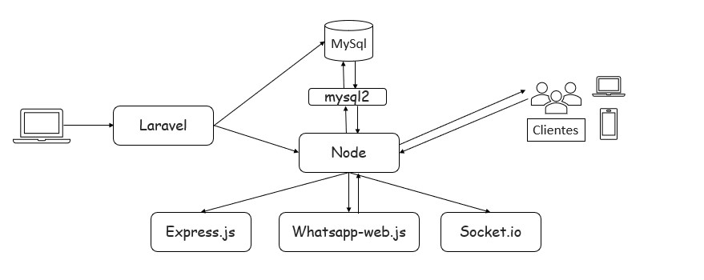
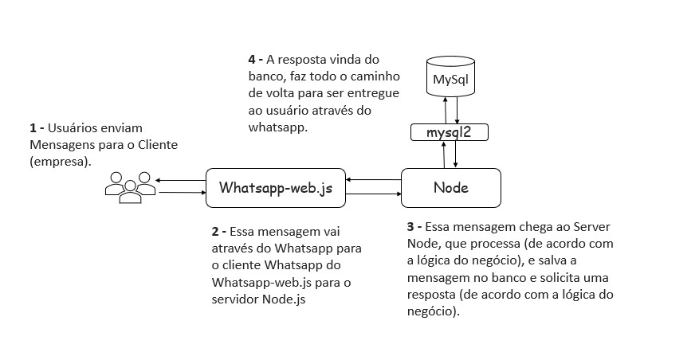

# ChatZaping

Sistema de automação de respostas que utiliza o Whatsapp como principal base. Ele automatiza as mensagens e serviços que uma empresa pode disponibilizar para seus clientes, fazendo o gerenciamento do atendimento e encaminhamento para setores / atendentes de forma automática.

- Projeto pensado para suprir uma demanda sobre gerenciamento de atendimento automático.
- Para o desenvolvimento desse sistema alguns desafios precisavam ser superados, como a comunicação em tempo real entre o serviço que faz o controle das mensagens que chegam dos usuários via Whatsapp e as respostas cadastradas pelo ciente administrador do sistema.

## Tabela de conteúdos

ChatZaping:

- [Arquitetura](#arquitetura)
- [Fluxo do cliente](#fluxo-do-cliente)
- [Instruções de utilização](#instruções-de-utilização)

## Arquitetura



**Laravel**

*Utilizei o Laravel para o frontend / backend por se tratar de um framework robusto e de "fácil" implementação. Integração rápida com hospedagens de serviços, comunicação simples com APIs e bibliotecas, além de prática utilização do Template Blade para construção do frontend.*

**MySql**

*Banco de dados relacional de ampla utilização no mercado. Foi escolhido para esse projeto devido, principalmente, ao conhecimento e manuseio dos seus comandos por parte do desenvolvedor.*

**mysql2**

*É um wrapper para mysqljs/mysql que envolve chamadas de função com promessas (assincrono). Fornece uma comunicação rápida e segura com o banco de dados mysql através do Node.js.*

**Node.js**

*O Node permite a execução de códigos JavaScript fora de um navegador web de maneira assincrona e orientada por eventos. Devido a essa característica (entre outras), o Node.js foi escolhido para ser, digamos, o 'coração' da aplicação.*

*Ele faz a 'coleta' e distribuição das mensagens enviadas pelos clientes do sistema, se comunicando com o Laravel de forma passiva, se comunica com o banco de dados, além de gerenciar as bibliotecas necessárias para o pleno funcionamento da aplicação.*

**Whatsapp-web.js**

*É uma biblioteca cliente do WhatsApp para NodeJS que se conecta por meio do aplicativo de navegador da Web do WhatsApp (Puppeteer). Essa ferramenta foi escolhida por se tratar de uma biblioteca gratuita e com uma documentação simples de ser entendida. Possui muitas funcionalidades legais, como: Envio de botões, listas e imagens, além do gerenciamento de grupos.. tudo por meio da linguagem JavaScript.*

*Exemplo:*
``` 
client.on('message', message => {
	if(message.body === '!ping') {
		client.sendMessage(message.from, 'pong');
	}
});
  ```
  

*O código acima mostra uma resposta programada da biblioteca onde o usuário enviou uma mensagem contendo o texto '!ping' e recebe uma mensagem de volta com o texto 'pong'.*

**Express.js**

*Express JS é um framework web estruturado, escrito em JavaScript e que roda sobre o ambiente NodeJS em tempo de execução. Uma das principais vantagens é que o Express JS possui bastante bibliotecas. Além disso, é possível usar qualquer banco de dados e integrar com vários tipos de serviços.*

**Socket.io**

*Socket.IO é uma biblioteca que permite comunicação de baixa latência, bidirecional e baseada em eventos entre um cliente e um servidor.*

*Ela é construída sobre o protocolo WebSocket (WebSocket é um protocolo de comunicação que fornece um canal full-duplex e de baixa latência entre o servidor e o navegador), e oferece garantias adicionais, como fallback para HTTP long-polling ou reconexão automática.*

## Fluxo do Cliente



## Instruções de utilização

*Instruções em produção...*

## Observação

*Caso queira clonar (baixar) o código fonte desse sistma e utilizar em seu projeto pessoal, será preciso instalar (via npm ou yarn) todas as bibliotecas citadas acima.*

*Estas bibliotecas necessitam de um espaço em disco de, pelo menos, 400 MB. O que ficaria inviável armazenar aqui no repositório.*

*Devido a essa questão de espaço, a pasta onde são instaladas as bibliotecas, foi excluida do repositório (node_modules), dentro do diretório public/Api.*

*Sendo assim, basta instalar as bibliotecas citadas dentro do diretório public/Api que o sistema funcionara normalmente.*
